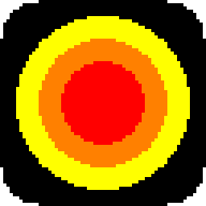
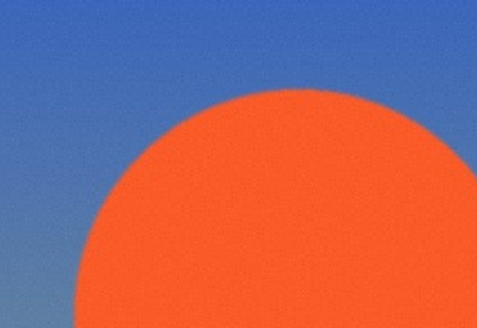
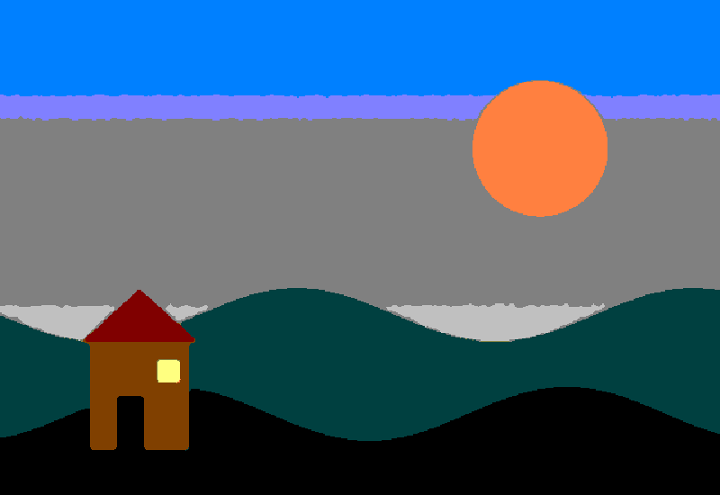

# Red Sun



Turn any photo into a sharp, color-indexed **MS Paint style bitmap**. Big enough to print as a poster, clean enough to post.

Red Sun does what Photoshop's *Image → Mode → Indexed Color* and *Bitmap (50% threshold)* do, in batch, with a browser GUI: every pixel of the image is forced into a small exact palette (or pure black and white) **at native resolution**. There are no intermediate anti-aliased values, so edges stay one pixel hard no matter how far you zoom. Nothing is ever resampled; the only enlargement is a whole-number nearest-neighbour multiply.

- **Flat buckets.** The default palette is the image's *own* colours: only pixels inside flat regions (or one-pixel strokes) get a vote, near-identical shades merge, edge blends never earn a bucket, and black and white are forced in when present. Every pixel then snaps to the nearest bucket: either / or. Also adaptive median cut (photos), classic MS Paint 28, Windows 16, web-safe 216, and pure black & white with automatic (Otsu) or fixed 50% threshold.
- **Classic dithering, or none.** Diffusion (Floyd–Steinberg), ordered 8×8 pattern, or noise, with a strength knob. Off by default for flat, rigid regions.
- **Poster sized.** Sources smaller than your minimum width (default 3200 px) are multiplied up by a whole number. Larger sources keep every pixel. The files stay small because they are indexed.
- **Results next to your pictures.** Every batch lands in a new `red-sun-run-001`, `-002`, … folder inside the folder you processed, with a `settings.json` beside the outputs. No hunting through app folders. Choose another output folder if you prefer.
- **Choose folder… opens your system's own folder dialog** (the standard macOS / Windows panel), so no paths to type. Pick the folder with your pictures, or a single image.
- **Remembers you.** Every setting and the last folder persist between sessions.
- **Batch.** One bad file never stops the rest; recursive scans skip earlier run folders. Originals are never modified.
- **A GUI that looks like 1999 on purpose.** Plain HTML forms, zero JavaScript. Also a CLI with the same options.

| Source (1:1 crop) | Red Sun, adaptive 12 colours, no dither (same 1:1 crop) |
|---|---|
|  |  |

> **Viewing tip.** Most image viewers (macOS Preview, browsers showing a bare image) smooth pixels when you zoom in. The file is exact regardless; use the **View every pixel** page in Red Sun, or Photoshop / GIMP, to see the hard boundaries. Every result also reports its colour count.

## Run it

### Option A: the app (no Python needed)

Download the release ZIP, extract it completely, and double-click the launcher for your system:

| System | Launcher |
|---|---|
| macOS (Intel and Apple Silicon) | `Open Red Sun — macOS.app` |
| Windows x64 | `Open Red Sun — Windows x64.exe` |
| Windows ARM64 | `Open Red Sun — Windows ARM64.exe` |
| Linux x86_64 | `Open Red Sun — Linux x86_64.AppImage` |
| Linux ARM64 | `Open Red Sun — Linux ARM64.AppImage` |

The first launch opens a setup page in your browser, downloads a private Python runtime and the one locked dependency (Pillow) into your application-data folder, then opens the Red Sun page. Later launches are instant and offline. Keep the launcher next to the `app` folder.

**Release status.** The ZIP built and tested so far covers **macOS** (launch verified) and **Windows x64 / ARM64** (built, not yet run on a Windows machine). Linux AppImages need a Linux build host and are not in the current ZIP. Unsigned launchers can trigger macOS Gatekeeper ("unidentified developer": right-click → Open) or Windows SmartScreen ("More info → Run anyway").

### Option B: from this repository

Needs [uv](https://docs.astral.sh/uv/) **or** Python 3.10+.

```bash
./run.sh          # macOS / Linux   (or double-click run.command on macOS)
```

```powershell
.\run.ps1         # Windows
```

Your browser opens at `http://127.0.0.1:<port>`. Quit from the page footer or with Ctrl+C.

### Option C: command line

```bash
PYTHONPATH=app/src uv run --project app python -m red_sun ./comics                     # -> ./comics/red-sun-run-001/, flat buckets
PYTHONPATH=app/src uv run --project app python -m red_sun comic.tif --mode bw --threshold 128 --dither pattern --dither-strength 100
```

```
python -m red_sun <file-or-folder>
    [--mode auto|color|bw] [--palette dominant|adaptive|paint|win16|websafe] [--colors N]
    [--dither none|diffusion|pattern|noise] [--dither-strength 0-100]
    [--sharpen] [--contrast] [--despeckle] [--threshold 0-255] [--matte white|gray|black]
    [--grid WIDTH] [--min-output-width PX] [--format png|bmp|gif|all] [--recursive] [--out DIR]
```

## The knobs

| Setting | Default | What it does |
|---|---|---|
| Mode | Auto | Auto picks black & white for grayscale sources, colour otherwise. |
| Palette | Flat buckets, N ≤ 16 | The image's own flat colours, up to N, most common first; blends and anti-aliasing never become buckets. *Adaptive* is median cut with exactly N (photos). Fixed palettes give the authentic Paint / Windows / Netscape look. |
| Dither | None | *Diffusion* = Floyd–Steinberg; *Pattern* = ordered 8×8 Bayer; *Noise* = random. None keeps regions flat. |
| Dither strength | 60 % | Amplitude of the pattern or noise field. 100 % is the full classic halftone in black & white. |
| Sharpen | off | Unsharp mask before the snap. Helps photos; on flat art it draws halos, so leave it off for comics. |
| Contrast boost | off | Black & white: autocontrast stretch (good for scans). Colour: a fixed, hue-safe 1.3×. |
| Despeckle | off | 3×3 median first. Kills film grain and JPEG noise at the cost of the finest detail. |
| Threshold | automatic | Black & white cut, 0–255. Blank = Otsu. 128 = Photoshop's 50%. |
| Matte | White | Colour that transparent pixels are flattened onto. Netscape gray (#CCCCCC) and black available. |
| Pixel grid width | native | Blank keeps every source pixel. A number downsamples once (Lanczos) to a chunky grid before the snap. |
| Minimum output width | 3200 | Results narrower than this are multiplied by a whole number with nearest neighbour. 0 = never. |
| Format | PNG | Indexed PNG, indexed BMP, GIF, or all three. |

Output location: `<folder you processed>/red-sun-run-NNN/` (for a single image, next to that image). Output names: `<name>_redsun_flat16.png`, `<name>_redsun_16c.png` (adaptive), `<name>_redsun_paint28.png`, `<name>_redsun_web216-pattern.png`, `<name>_redsun_bw-diffusion.png`, and so on. Duplicate names inside one batch get `-2`, `-3`.

## Develop

```bash
uv run --project app --group dev pytest        # unit tests (tests/test_core.py, tests/test_server.py)
uv run --project app python tests/smoke.py     # real HTTP end-to-end smoke (browser page, batch, persistence)
python3 packaging/build_release.py             # icons, uv tools, launcher images, ZIP (see below)
```

`packaging/build_release.py` builds every launcher image the current host can build (macOS needs a Mac, Windows needs `go-winres`, Linux needs `appimagetool` on a Linux host), stages the release root, and writes either the official universal ZIP (all five images) or a clearly named `PARTIAL` ZIP. Requires Go and uv on the build machine; customers need nothing.

See [ARCHITECTURE.txt](ARCHITECTURE.txt) for how the pieces fit, and [TUTORIAL.md](TUTORIAL.md) for a walkthrough and troubleshooting.

## License

Copyright © 2026 Goosnav LLC. All rights reserved. See [LICENSE](LICENSE).
